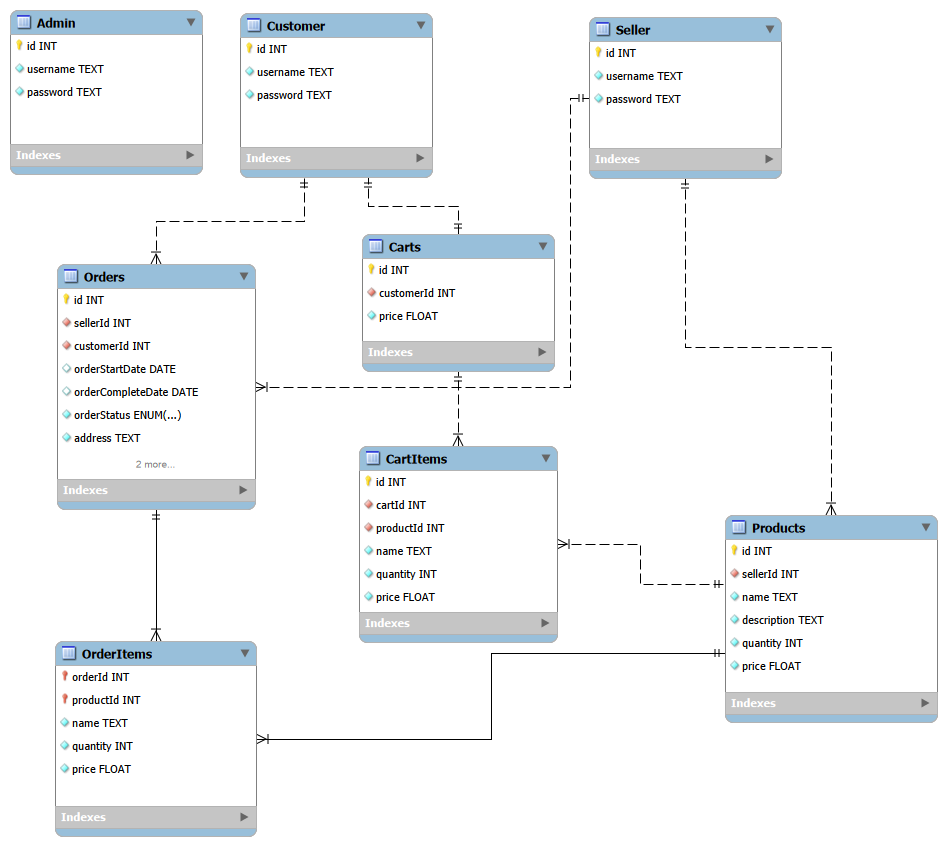

# Spring Boot e-Commerce REST API

- [API Sample.md](API%20Sample.md)
- [Task.md](Task.md)
- [Issue.md](Issue.md)

---

- Using JSON Web Token authentication.
- One admin only and do not store in the database (use YAML properties data).
- Username cannot repeat. (Caused by loadUserByUsername())
- Each seller cannot have same product name.
- When delete seller, their product also will delete.
- Seller only can COMPLETE or CANCEL order.
- Customer only can CANCEL order.

### 1. Function

- Background (User) management
- Seller management
- Customer management
- Product management
- Cart management
- Order management

### 2. Database



Users
- id (Primary key)
- username
- password
- role (ADMIN/SELLER/CUSTOMER)

Products
- id (Primary key)
- sellerId (Foreign key)
- name
- description
- quantity
- price

Carts
- id (Primary key)
- customerId (Foreign key)
- price

CartItems
- id (Primary key)
- cartId (Foreign key)
- productId (Foreign key)
- name
- quantity
- price

Orders
- id (Primary key)
- sellerId (Foreign key)
- customerId (Foreign key)
- orderStartDate
- orderCompleteDate
- orderStatus
- address
- creditCard
- price

OrderItems
- orderId (Primary key, Foreign key)
- productId (Primary key, Foreign key)
- name
- quantity
- price

### 3. API

Authentication

| Method | API             | Function |
|--------|-----------------|----------|
| POST   | /api/auth/login | Login    |

Admin

| Method | API                       | Function                   |
|--------|---------------------------|----------------------------|
| GET    | /api/admin                | View customers and sellers |
| POST   | /api/admin/customers      | Add customer               |
| GET    | /api/admin/customers      | View customers             |
| GET    | /api/admin/customers/{id} | View customer {id}         |
| PUT    | /api/admin/customers      | Update customer            |
| DELETE | /api/admin/customers/{id} | Delete customer {id}       |
| POST   | /api/admin/sellers        | Add seller                 |
| GET    | /api/admin/sellers        | View sellers               |
| GET    | /api/admin/sellers/{id}   | View seller {id}           |
| PUT    | /api/admin/sellers        | Update seller by id        |
| DELETE | /api/admin/sellers/{id}   | Delete seller {id}         |

Customer

| Method | API                    | Function                         |
|--------|------------------------|----------------------------------|
| POST   | /api/customer/register | Sign up and create cart          |
| PUT    | /api/customer          | Update current customer          |
| DELETE | /api/customer          | Delete current customer and cart |

Seller

| Method | API                  | Function              |
|--------|----------------------|-----------------------|
| POST   | /api/seller/register | Sign up               |
| PUT    | /api/seller          | Update current seller |
| DELETE | /api/seller          | Delete current seller |

Product

| Method | Authority | API                  | Function                       |
|--------|-----------|----------------------|--------------------------------|
| POST   | Seller    | /api/products        | Add seller's product           |
| GET    | Any       | /api/products        | Get all products               |
| GET    | Any       | /api/products/{id}   | Get product {id}               |
| GET    | Any       | /api/products/{name} | Get products {name}            |
| PUT    | Seller    | /api/products        | Update seller's product        |
| DELETE | Seller    | /api/products/{name} | Delete seller's product {name} |

Cart

| Method | Authority | API       | Function             |
|--------|-----------|-----------|----------------------|
| GET    | Customer  | /api/cart | Get all cartItems    |
| PUT    | Customer  | /api/cart | Update cartItem      |
| DELETE | Customer  | /api/cart | Delete all cartitems |

Order

| Method | Authority        | API              | Function                     |
|--------|------------------|------------------|------------------------------|
| POST   | Customer         | /api/orders      | Add order                    |
| GET    | Seller, Customer | /api/orders/{id} | Get order {id}               |
| GET    | Seller, Customer | /api/orders      | Get all orders               |
| PUT    | Seller           | /api/orders      | Update order status of order |
| DELETE | Seller, Customer | /api/orders      | Cancel order                 |

### 4. Technique

Backend
- Java + Spring Framework

Spring Framework
- Spring Boot
- Spring Boot DevTools
- Spring Boot Validation
- Spring Web
- Spring Security
- Spring Data JPA

Database
- MySQL
  - MySQL Driver

Other
- Lombok

### 5. Flowchart


### 6. Environment
```yaml
server:
    port: 8080

spring:
    datasource:
        url: jdbc:mysql://localhost:3306/ecommerce?createDatabaseIfNotExist=true
        username: USERNAME
        password: PASSWORD
    jpa:
        hibernate:
            ddl-auto: none
    sql:
        init:
            mode: always

admin:
    username: admin
    password: admin

jwt:
  expiration: 3600000
```
